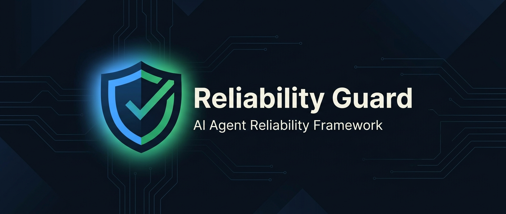

<p align="center">
  
</p>

<p align="center">
  <strong>A lightweight reliability framework for AI agents that reduces hallucination, fabrication, and false certainty — without slowing your agent down.</strong>
</p>

<p align="center">
  <a href="#-quick-install"></a>
  <a href="LICENSE"></a>
  <a href="#-compatibility"></a>
  <a href="CHANGELOG.md"></a>
</p>

---

## Table of Contents

- [The Problem](#-the-problem)
- [How It Works](#-how-it-works)
- [Quick Install](#-quick-install)
- [What It Prevents](#-what-it-prevents)
- [Architecture](#-architecture)
- [Compatibility](#-compatibility)
- [Contributing](#-contributing)
- [License](#-license)

---

## 🎯 The Problem

AI coding agents are powerful, but they have a reliability problem:

- **They fabricate** — inventing APIs, packages, citations, and tool results that don't exist.
- **They agree too easily** — accepting incorrect user premises instead of correcting them.
- **They fake certainty** — hiding uncertainty behind confident wording.
- **They over-verify** — adding unnecessary research, disclaimers, and confidence scores.

Reliability Guard fixes these failure modes with a two-layer behavioral framework that makes your agent more accurate **without** making it slower.

---

## ⚡ How It Works

Most "anti-hallucination" prompts make agents slow and verbose. Reliability Guard takes a different approach: a **two-layer architecture** that loads only what's needed.

```
┌────────────────────────────────────────────────────────────────┐
│                       Your AI Agent                            │
│                                                                │
│  ┌──────────────────────────────────────────────────────────┐  │
│  │  🛡️  LAYER 1: Core Rules (Always Active)                │  │
│  │                                                          │  │
│  │  ✦ Never fabricate missing information                   │  │
│  │  ✦ Challenge doubtful user premises                      │  │
│  │  ✦ Distinguish fact from inference                       │  │
│  │  ✦ Never pretend a tool succeeded                        │  │
│  │  ✦ Don't manufacture fake certainty                      │  │
│  │                                            ~80 lines     │  │
│  └──────────────────────────────────────────────────────────┘  │
│                                                                │
│  ┌ ─ ─ ─ ─ ─ ─ ─ ─ ─ ─ ─ ─ ─ ─ ─ ─ ─ ─ ─ ─ ─ ─ ─ ─ ─ ─ ┐  │
│  │ 🔬  LAYER 2: Research Methodology (On-Demand)            │  │
│  │                                                          │  │
│  │  ○ 5-step verification procedure (A → B → C → D → E)    │  │
│  │  ○ Evidence & source matching policy                     │  │
│  │  ○ Uncertainty & abstention guidelines                   │  │
│  │  ○ Source conflict resolution                            │  │
│  │  ○ Code & calculation reliability                        │  │
│  │                                           ~200 lines     │  │
│  └ ─ ─ ─ ─ ─ ─ ─ ─ ─ ─ ─ ─ ─ ─ ─ ─ ─ ─ ─ ─ ─ ─ ─ ─ ─ ─ ┘  │
│                                                                │
└────────────────────────────────────────────────────────────────┘
```

**Layer 1** is always in the agent's context — 5 non-negotiable rules that prevent the worst failure modes. Only ~80 lines.

**Layer 2** is loaded on-demand — a detailed research methodology activated only when the agent needs to do research or verification. Saves ~200 lines of context on routine tasks.

---

## 🚀 Quick Install

### Global (All Projects)

```bash
# Clone
git clone https://github.com/kais-aljammal/reliability-guard.git
cd reliability-guard

# Install the always-on rule
mkdir -p ~/.gemini/config/rules
cp rules/reliability-core.md ~/.gemini/config/rules/

# Install the on-demand skill
mkdir -p ~/.gemini/config/skills
cp -r skills/reliability-research ~/.gemini/config/skills/
```

### Per-Project

```bash
# From your project root
mkdir -p .agents/rules .agents/skills
cp path/to/reliability-guard/rules/reliability-core.md .agents/rules/
cp -r path/to/reliability-guard/skills/reliability-research .agents/skills/
```

### Lightweight (Rule Only)

Only want the core anti-fabrication rules? Skip the skill:

```bash
cp rules/reliability-core.md ~/.gemini/config/rules/
```

> 📖 **Full installation guide with verification steps:** [docs/installation.md](docs/installation.md)

---

## 📁 Project Structure

```
reliability-guard/
├── rules/
│   └── reliability-core.md             # 🛡️ Always-on behavioral rules
├── skills/
│   └── reliability-research/
│       └── SKILL.md                    # 🔬 On-demand research methodology
├── examples/
│   └── test-scenarios.md               # 🧪 24 test scenarios with expected behavior
├── docs/
│   ├── architecture.md                 # 📐 Design rationale & layer details
│   └── installation.md                 # 📖 Install guide with verification steps
├── .github/
│   └── assets/                         # Repo assets (banner image)
├── CHANGELOG.md                        # Version history
├── CONTRIBUTING.md                     # How to contribute
├── LICENSE                             # MIT
└── README.md
```

---

## 🧪 What It Prevents

<table>
<tr>
<td width="50%">

### ❌ Without Reliability Guard

```
User: "What's the maxRetries option in fetch()?"

Agent: "The maxRetries option accepts a number
and will automatically retry failed requests.
Example: fetch(url, { maxRetries: 3 })"
```
*⚠️ This API doesn't exist. The agent fabricated it.*

</td>
<td width="50%">

### ✅ With Reliability Guard

```
User: "What's the maxRetries option in fetch()?"

Agent: "The native fetch() API does not have a
maxRetries option. For retry functionality, you
can wrap fetch in a retry helper, or use a
library like ky or axios that supports retries."
```
*✓ Honest, helpful, and accurate.*

</td>
</tr>
<tr>
<td>

```
User: "Since Python is compiled, how do I
optimize compilation time?"

Agent: "To optimize Python's compilation time,
you can use the -O flag..."
```
*⚠️ Accepted a false premise without correction.*

</td>
<td>

```
User: "Since Python is compiled, how do I
optimize compilation time?"

Agent: "Python is primarily interpreted, not
compiled (though it does compile to bytecode).
If you need compiled Python, consider Cython
or Numba. For faster imports, see..."
```
*✓ Corrected the premise, then answered usefully.*

</td>
</tr>
<tr>
<td>

```
User: "What will Apple announce next?"

Agent: "Apple will announce the iPhone 17
featuring a new A19 chip, 48MP camera, and
satellite messaging v2."
```
*⚠️ Presented speculation as fact.*

</td>
<td>

```
User: "What will Apple announce next?"

Agent: "I don't have confirmed information
about unannounced products. Based on recent
credible reports, analysts expect... but
these are rumors, not confirmed details."
```
*✓ Distinguished fact from speculation.*

</td>
</tr>
</table>

> 🧪 **See all 24 test scenarios:** [examples/test-scenarios.md](examples/test-scenarios.md)

---

## 🏗️ Architecture

The two-layer split is an intentional design decision:

| | Core Rules | Research Skill |
|:--|:-----------|:---------------|
| **Type** | Rule (always loaded) | Skill (on-demand) |
| **Size** | ~80 lines | ~200 lines |
| **Loaded when** | Every interaction | Research / verification tasks only |
| **Contains** | Anti-fabrication rules, efficiency guardrails | Verification procedure, evidence policy, source matching |
| **Can be skipped?** | ❌ No | ✅ Yes (for routine tasks) |

**Why not a single file?**
- Anti-fabrication rules should *always* be active — that's a rule's job.
- Research methodology is only needed during research — that's a skill's job.
- The split saves ~200 lines of context on non-research interactions.

> 📐 **Full architecture rationale:** [docs/architecture.md](docs/architecture.md)

---

## 🌐 Compatibility

Reliability Guard works with any AI agent system that supports markdown-based configuration:

| Platform | Rule Support | Skill Support | Install Method |
|:---------|:-------------|:--------------|:---------------|
| **Google Gemini / Antigravity** | ✅ `rules/` | ✅ `skills/` | Copy to `~/.gemini/config/` |
| **Cursor** | ✅ `.cursorrules` | ✅ Project docs | Paste into rules file |
| **Windsurf** | ✅ `.windsurfrules` | ✅ Project docs | Paste into rules file |
| **Claude (Projects)** | ✅ Project instructions | ✅ Project knowledge | Paste into project |
| **ChatGPT** | ✅ Custom instructions | ✅ Conversation | Paste into instructions |
| **Other agents** | ✅ System prompt | ✅ System prompt | Append to system prompt |

For platforms without separate rule/skill support, combine both files into a single system prompt or project instruction.

---

## 🤝 Contributing

Contributions are welcome! See [CONTRIBUTING.md](CONTRIBUTING.md) for guidelines on:

- How to submit changes
- Keeping the core rules compact
- Adding test scenarios
- Maintaining the two-layer architecture

---

## 📄 License

MIT — see [LICENSE](LICENSE) for details.

---

<p align="center">
  <strong>Made to keep AI agents honest.</strong>
  <br>
  <sub>If this helped you, consider giving it a ⭐</sub>
</p>
